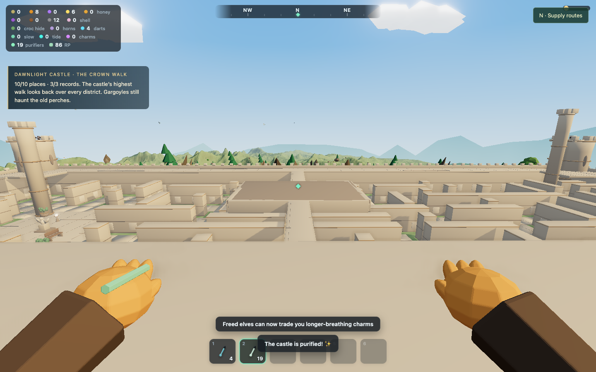
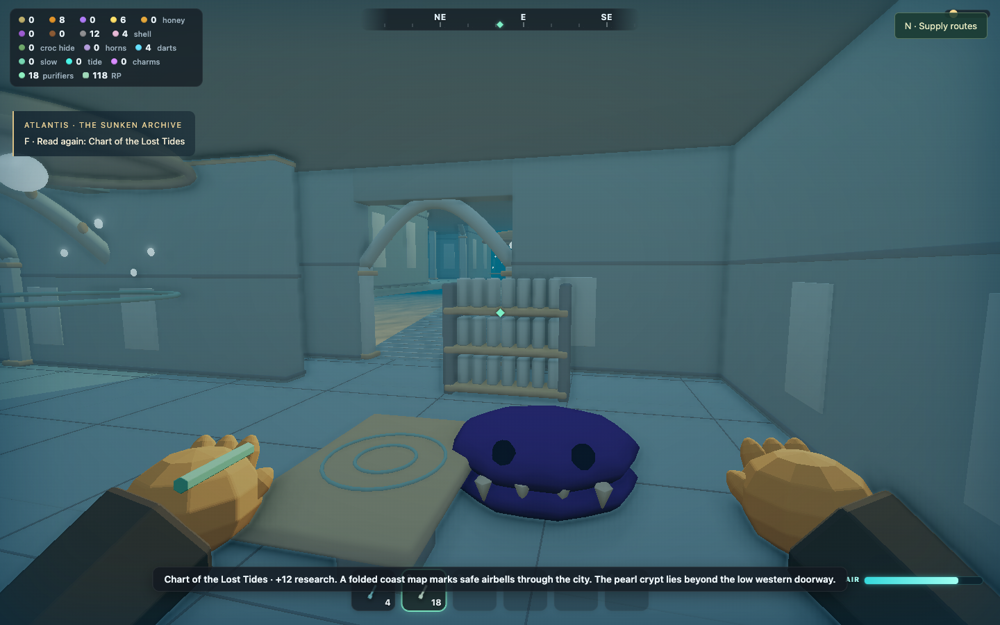
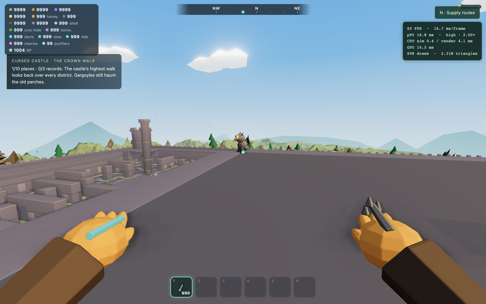
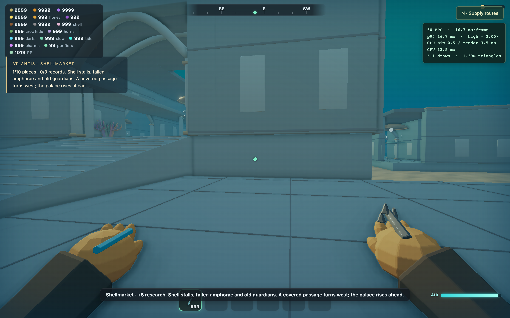

# Castle and Atlantis — exploration rebuild

Both landmarks now have ten named places, connected interiors, vertical routes,
readable records and detailed Blender furniture. Sky Kingdom remains the model
for their density and sense of discovery.

## Castle: a ward you can climb

The original maze, gate, purification crystal, gargoyle perches and hunting
spires remain in place. The new architecture adds routes above that familiar
layout and turns its halls and courts into distinct destinations.

| Place | What changed |
| --- | --- |
| Lantern Gate | A broad exterior stair beside the eastern entrance climbs to the battlements. |
| High Watch | A complete rampart circuit, parapets and inner corner bypasses around the four towers. |
| Mossheart Cloister | Memorial garden, planters, benches and sheltered stone courts. |
| Provisioners’ Court | Market awnings, barrels, crates and stores. |
| Banner Court | Standards, braziers and a large planning table. |
| Lantern Library | Bookshelves, reading tables, a chandelier and carved vault ribs; both ground entrances remain. |
| Ember Hall | A forge, stores and the wardens’ map table, with two ground entrances. |
| Crystal Keep | A furnished chamber and four turning stair flights leading through the keep. |
| Wardens’ Galleries | Raised bridges connect both hall roofs, the outer walls and upper keep doorways. |
| Crown Walk | A walkable keep roof, the final castle record and views across the ward. |

A full route can start at the gate stair, follow the eastern and northern walls,
cross the library roof, enter the keep upstairs and climb to the Crown Walk.
Another bridge leads west through a turn to the forge roof and western wall.
The keep can also be climbed entirely from its ground-floor chamber. These
routes use ordinary walking; no movement upgrade is required.

Purifying the crystal replaces the entire castle dressing with warm limestone,
blue roof accents and brighter banners. Both states share the same floor plan.
Existing goblin-to-elf purification and creature progression still apply.

## Atlantis: a city with inside and outside

The old solid palace blocks have been replaced by actual rooms, passages,
galleries and open shafts. The city extends across the existing lagoon floor.

| Place | What changed |
| --- | --- |
| Drowned Causeway | An arched approach with lamps and breathing refuges. |
| Shellmarket | A broad plaza with shell stalls, amphorae and old guardians. |
| Tidal Nave | A large palace interior with side galleries and an open central water shaft. |
| Kelp Arcade | A roofed passage with three turns, linking the market to the archive. |
| Sunken Archive | Stone tablet shelves, a chart table, several doors and a back route. |
| Pearl Crypt | A low, hidden room beyond the archive’s western doorway, with pearl coffers. |
| Tideworks | A rotating tidewheel, records and doors connecting the palace and gardens. |
| Coral Conservatory | An open coral garden, colonnades and an easy surface exit. |
| Royal Galleries | An upper circuit around the nave, reached by swimming through its open center. |
| Crown Observatory | An upstairs room containing the final chart and an open oculus to daylight. |

For a gentle first entry, swim on the surface toward the arched causeway, then
press Q to descend to its first airbell. The observatory exit is beside its
airbell, through the open oculus.

The lower loop connects market → arcade → archive → back road → conservatory
→ tideworks → nave. The crypt is a side discovery. From the nave, rise through
the central opening to the galleries and Crown Observatory.

The lower buildings, roads and stairs sit on solid masonry foundations sunk
below the rippled seabed. Four piers support the raised Crown Observatory;
the swimming passage along the back road stays open beneath it. These supports
share the collision layout, so the player cannot swim through the foundations.

Fourteen brass airbells provide breathing refuges along these routes. Swim
beneath a bell, inside its luminous ring, to refill breath. The player remains
underwater and uses the existing **Q/E** dive/rise controls. The starting breath
capacity, refill rate, swim speed and existing upgrades are unchanged. The
extra stations shorten the route legs for a player without the Currentboard.

Uncontrolled kelp scatter is excluded from authored floors and door approaches;
corals and furnishings are deliberately placed within the city instead.
Clams keep their stable IDs, including saved purification, and three guards now
live in appropriate new rooms. Crocodile friendship is preserved. Masonry
blocks projectiles, clam attacks and crocodile movement/chasing through walls.

## Exploration rewards and saves

Entering a named place grants **5 research points once**. Each biome has three
records, read with **F**, that explain its history and point toward another
part of the landmark.

| Reward | Castle | Atlantis |
| --- | --- | --- |
| Each record | 12 RP + 2 sparks | 12 RP + 2 shells |
| All three records | 12 stone + 8 resin | 10 shards + 3 croc hide |
| All ten discoveries | 50 RP total | 50 RP total |

Records can be reread without duplicating rewards. Progress is stored in the
optional `landmarkExploration` save field and sanitized on restoration. Old
saves start with no landmark discoveries; their existing resources, castle
state, purified clams, linked crocodiles and Sky Kingdom progress are retained.
Castle saves also preserve altitude on the new galleries and roof.

## Art and rendering decisions

The 78 new GLBs were authored and exported through the actual Blender MCP
bridge. The editable source is
[`castle-and-atlantis.blend`](../art/wildtag/landmarks/castle-and-atlantis.blend).
The [authoring guide](../art/wildtag/landmarks/README.md) documents rebuilding.

District geometry includes carved arches, softened masonry, string courses,
ashlar, pavement joints, stair nosings, crenellations and bastion collars.
Separate kits supply books, maps, stalls, banners, a forge, thrones, coral,
coffers, airbells and the tide engine. Moving pearls and the wheel keep their
Blender pivots.

Roof slabs own their exposed cap surface. Supporting wall geometry is fitted
under the slab, and intersecting walls share a single volume. This removes the
coplanar roof/wall faces that caused visible flickering on the keep, library,
forge and battlements, in both cursed and purified palettes.

The layout JSON drives both Blender architecture and a spatially indexed
collision system. Floors distinguish ground, intermediate galleries and roofs;
swimming respects walls and ceilings. The export checker verifies each layout
hash against the asset manifest, so collision edits cannot silently diverge
from the authored models.

Identical landmark materials are shared across GLBs. Stationary architecture
and furnishings are batched by district, while animated parts remain separate.
Batching preserves indexed vertices. Large meshes are divided into spatial
patches so the view can cull them independently; every original visible
triangle is retained. Two additional Blender models provide simplified shadow
silhouettes for stationary architecture and furniture. Moving parts retain
their own live shadows. Beauty and ambient occlusion use the full models; the
shadow passes avoid repeating their fine bevels and surface inlays. Underwater rendering stops at the fully opaque fog limit
and restores the full island range when the player surfaces.

The three legacy monolithic castle/Atlantis models remain as reference assets
but are marked `load: false`, avoiding duplicate startup downloads.

## Verification

### Performance

Hardware: Apple M5 / ANGLE Metal, Chrome, **High** quality, 1440×900 viewport
at 2× device scale (**2880×1800** drawing buffer). Each view was warmed up
before sampling 359 frame intervals. Runs were sequential.

| View | Average FPS | 99th-percentile frame | Frames over 50 ms |
| --- | ---: | ---: | ---: |
| Castle library | 60.0 | 16.8 ms | 0 |
| Castle forge | 60.0 | 16.8 ms | 0 |
| Castle Crown Walk | 60.0 | 16.8 ms | 0 |
| Atlantis nave | 60.0 | 16.8 ms | 0 |
| Atlantis arcade | 60.0 | 16.8 ms | 0 |
| Atlantis crown | 60.0 | 16.8 ms | 0 |
| Haven regression | 60.0 | 16.8 ms | 0 |
| Sky sanctuary regression | 60.0 | 16.8 ms | 0 |

The first new-art benchmarks measured 45.9 FPS in the castle library and 49.1
FPS in the nave. After batching, spatial culling, indexed geometry, shadow
silhouettes and the underwater fog cutoff, those views reached 60 FPS.
Submitted triangles fell from approximately 4.11M to 2.44M in the library and
2.53M to 1.26M in the nave, counting all render passes. These are measurements
on this machine, not a guarantee for every device.

Uncapped camera-panning stress runs averaged **126.2 FPS** in the library and
**126.4 FPS** in the nave. Each stress run had one interval over 50 ms; the
capped runs in the table had none. See
[the library panning report](wildtag/performance-depth-panning-castle-library.json)
and [the nave panning report](wildtag/performance-depth-panning-atlantis-nave.json).

Raw reports and screenshots are in `docs/wildtag/performance-depth-final-*`.
The 78 landmark assets occupy 42.6 MiB uncompressed, including the two shadow
models. The castle shadow model uses 19,402 triangles and Atlantis's uses
25,456. Visible model detail is preserved; fine bevels are simplified only in
the shadow representation.

### Functional verification

The complete [browser playthrough report](wildtag/landmarks/gameplay-verification.json)
passes with no browser errors. It checks:

- Gate stair, battlement corner bypass, library roof and upper keep entrance,
  followed by the Crown Walk; a separate climb covers all four keep stair flights.
- All ten castle discoveries and three records, plus a real purifying dart
  hitting the crystal and replacing the castle dressing.
- One continuous Atlantis dive using the starting **18-second breath** and
  normal swim speed, including the arcade turns, archive, crypt, back road,
  conservatory, tideworks, nave, royal galleries and observatory.
- Real purifier-dart rescue of the relocated arcade clam, stable ID **2003**.
- The surface exit beside the crown airbell, all twenty discoveries and six records.
- A normal save/reload preserving records, discoveries, one-time rewards,
  castle purification, the rescued clam and keep-roof altitude. Rereading a
  record does not duplicate rewards; the FPS overlay stays absent outside dev mode.

The test uses setup teleports between separate castle fixtures and at the start
of the dive. Traversal within the route uses normal movement inputs and the
production collision system; there are no route teleports or breath upgrades.

**Automated suite:** 1,086 tests across 66 files passed. Fifteen focused geometry,
movement, save and real-GLB pivot tests also passed after the final approach
and navigation polish. The production build and both asset checkers pass:
221 Wildtag Blender models plus 84 LOD variants, and all 50 Tiny Tide GLBs.

Sky City's full [gameplay regression](wildtag/sky/gameplay-verification.json)
also passed with no browser errors: trampoline-to-grapple ascent, the complete
walking loop, all seven places and three wind chimes, real eagle and seraphlet
captures, and save/reload of altitude, rewards, resource cooldowns and bonded
creatures. Releasing a sky creature restores its original sky home.

### Roof and foundation follow-up

After the reported roof flicker and floating Atlantis floors, **18 focused tests
across four files passed**, along with the production build and Wildtag asset
checker. Ray tests against the exported GLBs first reproduced the duplicate
castle roof faces, then confirmed a single exposed surface in both palettes.
Other tests check the visible foundation meshes, seabed contact and collision.

The [follow-up browser report](wildtag/architecture-fixes/verification.json)
passes with no browser errors. It covers thirteen views, both castle palettes,
stable roof heights, solid nave foundations, both nave entrances and the open
observatory underpass. Traversal uses game movement inputs between test fixtures.

Follow-up camera-panning benchmarks held **60.0 FPS** at high quality and
2880 × 1800 on the same M5/Metal setup. Both had **16.8 ms p99** and zero
intervals over 50 ms: [castle roof](wildtag/performance-architecture-fixes-castle-crown.json)
and [Atlantis nave](wildtag/performance-architecture-fixes-atlantis-nave.json).

