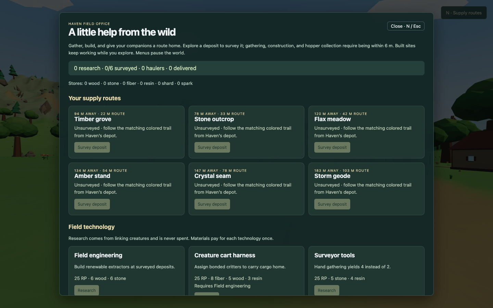
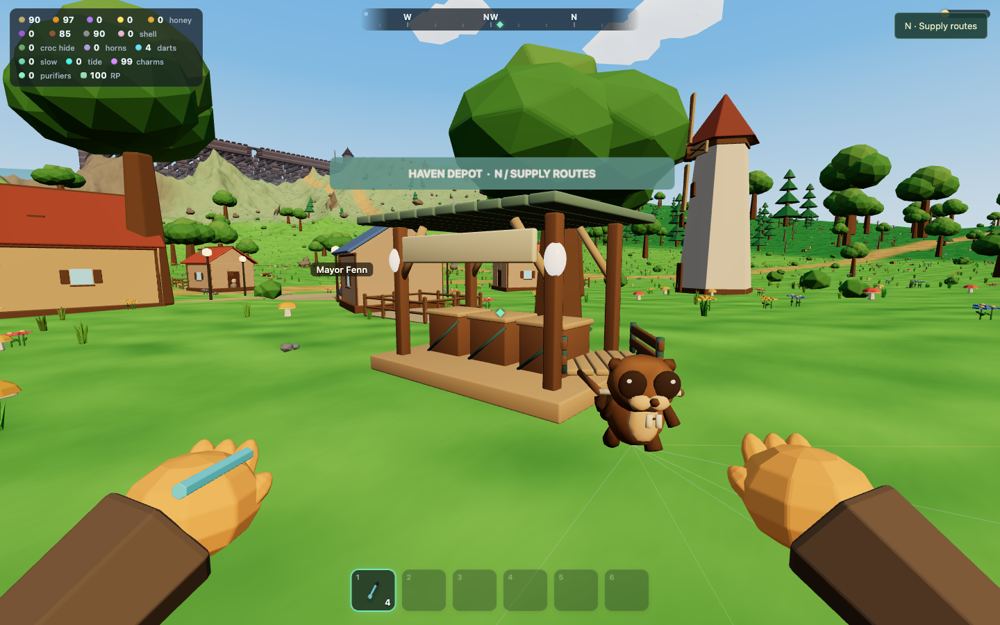
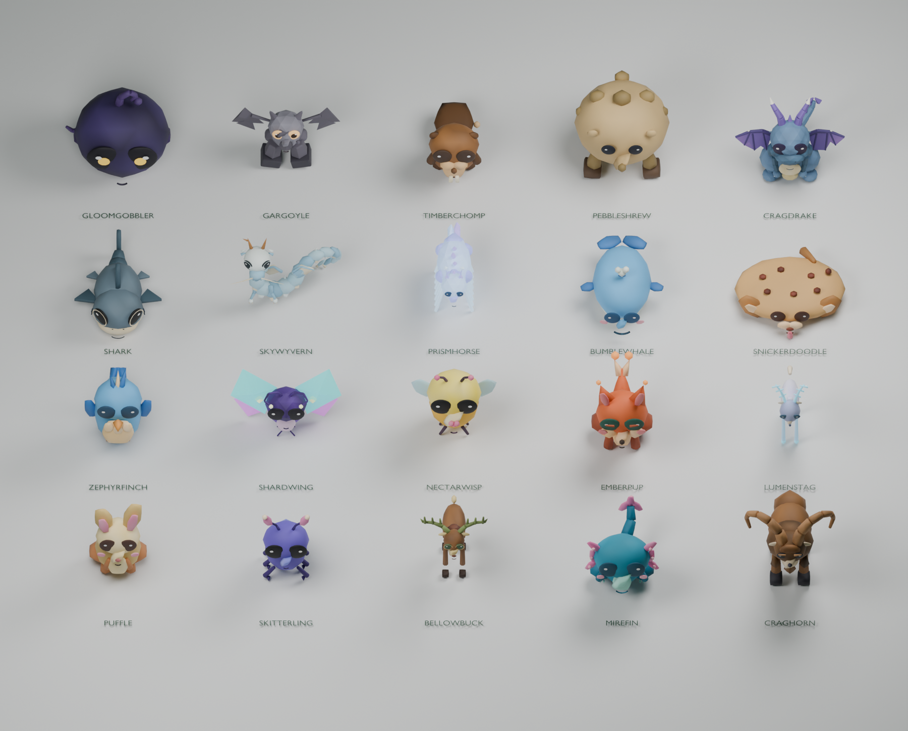

# Wildtag revamp — design and implementation review

Wildtag now has two connected reasons to explore: **link and bond creatures**, and **establish a renewable supply network**. Capture still earns research and companions. Natural deposits provide bulk materials, and companions can carry those materials back to Haven in visible carts.

Open `/wildtag.html` or `/` locally. Press **N** or click **Supply routes** to see the new system. The first timber grove and stone outcrop are just east of Haven. Your existing save migrates automatically.

## 1. What changed, and why

| Before | Now | Reason |
| --- | --- | --- |
| Small scattered pickups were the principal field gathering activity. | Six permanent, surveyable deposits complement the existing pickups. | Give gathering recognizable destinations and infrastructure worth returning to. |
| Wood and stone came exclusively from farm creatures. | Timber groves and stone outcrops provide both materials by hand, through extraction, or through hauling. | Remove the capture-before-building bottleneck and make construction available through exploration. |
| Bonded creatures mainly worked on farms, served as mounts, or went to barter. | An idle companion can receive an exclusive hauling assignment. | Make catching useful for logistics while retaining meaningful job choices. |
| Research primarily unlocked traversal tools. | A separate, connected field-technology branch improves extraction and transport. | Let players improve the supply bottleneck they can actually see. |
| All Wildtag models were generated as coarse geometry at runtime. | Rendering now uses a local library of Blender-refined model geometry and original Blender logistics assets. | Increase fidelity while retaining silhouettes, palettes, and animation behavior. |

The original tracking, traversal, castle, underwater, farming, barter, and building systems remain part of the game. The other games in this repository are outside this revamp.

## 2. The new play loop

1. **Find a deposit.** Supply Routes lists its distance. Colored trails extend from the Haven depot to all six sites. Permanent world signs identify the destinations.
2. **Survey and gather.** Within 6 m, press **F** to gather and automatically survey the deposit. You can also survey or gather from its Supply Routes card. Every deposit is renewable: two items per gather, followed by an eight-second recovery.
3. **Research field engineering.** Linking creatures supplies the existing RP gates. Research consumes materials once; it never spends RP.
4. **Build an extractor on site.** Construction requires standing within 6 m of a surveyed deposit. It produces into a local hopper. Inventory does not increase until you collect that hopper or a companion delivers cargo.
5. **Bond a companion.** The original sequence remains Link → craft Bond Charm → F to bond. Keep the creature idle in the roster, then assign it from the site's card after researching the harness.
6. **Watch the delivery.** The creature leaves Haven, follows the reserved trail, loads from the hopper, and returns with a cart. Cargo enters your inventory only on arrival at Haven.
7. **Improve the bottleneck.** Upgrade extraction if the hopper is empty; increase cart capacity or speed if the hopper fills faster than your companion can empty it.

Farms retain their specialty production and adjacency bonuses. Honey, mushrooms, shells, scales, and horns retain their existing acquisition loops. Bulk deposits reuse existing inventory materials, so supplies immediately feed existing crafting recipes.

## 3. Deposits and extraction

All six sites are in Haven's surrounding countryside. This is an initial regional network, with fixed trails, rather than a world-wide, player-authored routing system.

| Deposit | Material | Constructed site | Base output/minute | Upgraded output/minute |
| --- | --- | --- | ---: | ---: |
| Timber grove | Wood | Forester lodge | 12 | 24 |
| Stone outcrop | Stone | Stone quarry | 12 | 24 |
| Flax meadow | Fiber | Flax garden | 15 | 30 |
| Amber stand | Resin | Resin tap | 8.6 | 17.1 |
| Crystal seam | Shard | Crystal mine | 7.5 | 15 |
| Storm geode | Spark | Spark collector | 5 | 10 |

Each extractor costs **4 wood + 4 stone + 2 fiber**. Its hopper holds **32** items. Precision extraction permits a local upgrade costing **8 stone + 6 wood + 3 shard**, doubling production and increasing storage to **64**.

Full hoppers stop production without banking hidden catch-up output. Hand gathering remains available after construction. Deposits never exhaust permanently, avoiding a situation where a depleted map prevents further construction.

The Supply Routes screen shows materials on hand, survey status, production rate, hopper fill, delivered totals, worker, travel phase, cargo, and blocked trails. Gathering, hopper collection, construction, and upgrades require visiting the site. Research, assignment, and recall can be managed remotely.

## 4. Field technology

This branch lives in **N / Supply Routes**, beside site management. The original **C** crafting tree continues to handle equipment and consumables.

| Technology | RP gate | Material cost | Dependency | Effect |
| --- | ---: | --- | --- | --- |
| Field engineering | 25 | 6 wood, 6 stone | — | Build extractors |
| Creature cart harness | 25 | 8 fiber, 5 wood, 3 resin | Field engineering | Assign haulers |
| Surveyor tools | 25 | 5 stone, 4 resin | — | Hand gather 4 instead of 2 |
| Precision extraction | 75 | 14 stone, 8 shard, 6 resin | Field engineering | Unlock individual extractor upgrades |
| Roomy carts | 75 | 16 wood, 12 fiber, 4 shard | Cart harness | Double cargo capacity |
| Trailcraft | 180 | 20 wood, 12 shard, 8 spark | Roomy carts | Increase travel speed by 50% |

Keeping the familiar **25 / 75 / 180 RP** gates makes capture and gathering interdependent. There is no new currency, fuel tax, creature hunger meter, or conveyor system. Those would add maintenance before the central capture-and-delivery loop has had enough playtesting.

## 5. Creature jobs and transport rules

Every bonded species can haul. This avoids requiring a rare creature before the system becomes useful.

| Creature trait | Capacity | Speed |
| --- | ---: | ---: |
| General companion | 6 | 3.8 m/s |
| Bellowbuck, Prismhorse, Bumblewhale, Cragdrake | 12 | 3 m/s |
| Skitterling, Emberpup, Zephyrfinch, Skywyvern | 6 | 5 m/s |
| Timberchomp hauling wood, Pebbleshrew hauling stone, Craghorn hauling shards | 14 | 3.8 m/s |

Roomy carts doubles these capacities. Trailcraft multiplies these speeds by 1.5. Assignments are exclusive: a hauling creature cannot also work on a farm or serve as the active mount. Recall it first.

Haulers wait at the deposit until at least four items are available, then load up to capacity. Waiting for a small minimum avoids almost-empty deliveries without making the first shipment take a full-cart production cycle. A faster route eventually becomes extraction-limited; a distant route can become transport-limited.

**Cargo accounting:** collection removes items from the hopper; loading transfers them into the cart; arriving at Haven transfers them into inventory. Recalling a companion returns its cargo to the site hopper, including temporary storage overflow if necessary. Releasing a hauling creature also unwinds its assignment first. These rules prevent lost resources or a recall shortcut that teleports cargo into inventory.

Trails reserve clearance through procedural scenery. Player-built walls and cubes can obstruct them: a blocked hauler holds its cargo and the card explains what to clear. It resumes after the obstruction is removed. Routes currently follow fixed ground paths; flying creatures use the same paths and have no separate aerial routing system. Cart motion is visual rather than a separate rigid-body physics simulation.

Production and movement pause in menus, matching the existing farm simulation. They run while exploring away from the loaded area. There is no offline production while the game is closed.

## 6. Blender fidelity pass

The local **Blender MCP** executed the authoring and export process. Existing geometry served as proportion and palette references; Blender welded triangle seams, refined organic surfaces, beveled hard edges, and generated the exported replacement geometry. A visual review led to a gentler sculpting pass to reduce shrinkage in small limbs and facial details. Architecture has explicit geometry budgets to retain close-up chamfers without excessive repeated trim.

The library covers **104 existing model variants and 16 new logistics assets**:

| Category | Assets |
| --- | ---: |
| Creatures, including clam/crocodile/turtle forms | 23 |
| Village NPCs, goblin, elf | 7 |
| Scenery and distant mountains | 43 |
| Architecture, including village, both castle states, Atlantis, and building pieces | 7 |
| Equipment, held items, inventory models, farm dressing | 22 |
| Ward crystal | 1 |
| Cloud layer | 1 |
| Deposits, extractors, cart, cargo, trail marker, depot | 16 |

Blender also authored seamless ground-grain and water-normal maps. The editable scene is [art/wildtag/wildtag-art.blend](../art/wildtag/wildtag-art.blend). The machine-readable inventory is [asset-manifest.json](../public/wildtag/asset-manifest.json), including actual triangle counts and byte sizes.

**Runtime integration:** the existing constructors retain scene layout, individual scaling, animation pivots, and gameplay handles. Their visible mesh geometry is replaced from the Blender library before play. Existing procedural animation still drives those pivots. Repeated props remain batched; batch storage grows to accommodate the larger meshes. Building pieces reuse cached geometry, and the hand view releases its replacement meshes correctly. All art files ship locally; the game does not require a live Blender server.

Terrain topology, collision, animated water geometry, ropes, trails, particles, sky lighting, and UI layout remain generated systems. Their dynamic geometry cannot be replaced by a fixed model without changing behavior. Ground and water receive the new Blender surface maps; tangible model assets use the exported library. Audio is unchanged.

The initial model library was roughly **33 MiB**, plus two small surface maps. A progress screen covers loading. The subsequent [performance pass](WILDTAG-PERFORMANCE-REVIEW.md) adds 84 Blender distance variants (about 1.9 MiB), reduces rendering cost, smooths the camera and adds a dev FPS overlay. Asset streaming remains a potential boot-time improvement.

## 7. Saves and compatibility

The existing `wildtag-save-v1` storage key and v3 payload are retained. Logistics is an optional, independently restored section. Older saves receive an empty network and keep their inventory, research, bonded creatures, farm, structures, and progression.

The new section records survey state, construction, upgrades, hopper contents, cooldowns, research, assigned workers, travel distance, direction, cargo, and delivery totals. Restoring a route does not grant its cargo twice. Malformed fields are clamped or discarded; orphaned hauling statuses return to idle instead of trapping a creature in an unavailable job.

## 8. Verification and review points

- The full original and added unit suite passes: **1,039 tests across 56 files**, including economy tests for gathering cooldowns, research payment, hopper backpressure, exclusive jobs, round-trip delivery, recall, save recovery, and blocked routes.
- `npm run build` passes. Vite retains its existing warning about large JavaScript chunks.
- `python3 scripts/wildtag/check_assets.py` validates actual GLB geometry, finite coordinates, indices, byte counts, mesh-part coverage, and the complete source catalog.
- `node e2e/wildtag-overhaul.mjs` drives the browser through gathering, research buttons, construction, linking/bonding a test creature, assigning it, delivery, recall, and save/reload. Its debug hooks supply test materials and accelerate time; this is a functional test, not a measurement of normal progression duration.
- `e2e/wildtag-art.mjs` also verifies the production base path, high-quality scene, creature gallery, and companion-cart view.
- Blender renders and browser screenshots were inspected. Initial checks used desktop Chrome with software WebGL. The subsequent performance pass measured the Apple M5 GPU and brings the full suite to 1,048 passing tests. Mobile hardware performance and long-session economic balance have not been measured.

The most useful next playtest is a fresh session without debug grants: get one timber route running, add a stone route, then choose between faster extraction and larger carts. The key balance question is whether both exploration and capturing remain attractive once those two basic routes are established.
