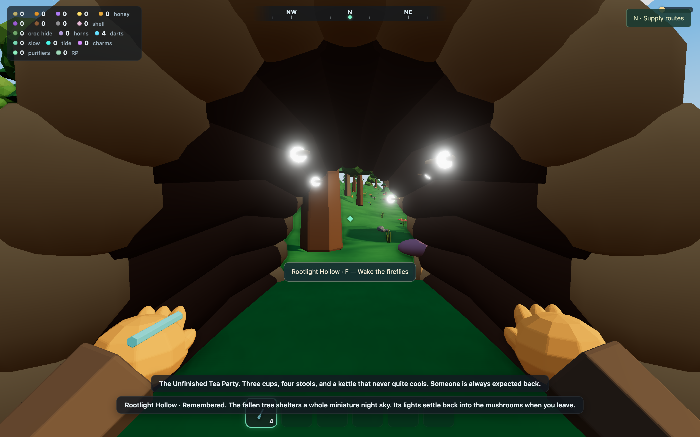
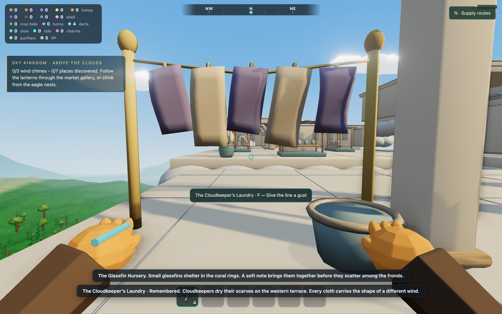

# Wildtag — small wonders

Eighteen optional scenes give the island signs of everyday life: two in each
of the five mainland biomes, the coast, castle, Atlantis and Sky Kingdom. They
use original models authored through Blender MCP.

## What it feels like to play

These are places to stumble across while travelling. A small prompt appears
when you are close and looking at the scene. Press **F** to turn a mechanism,
wake its lights, play a few soft notes or set something moving. Each scene has
its own short piece of environmental storytelling.

There is no checklist on the HUD, map-marker trail, currency reward or resource
cost. Finding everything is optional. Creature catching, extraction, hauling
and the existing landmark records retain their own progression.

The first interaction remembers the visit. Repeated interactions replay the
reaction, with a short cooldown; several scenes stay subtly livelier afterward.
Only a first visit triggers a discovery save. Replaying a reaction or pressing
F during its cooldown consumes the input without serializing the game again.
Old saves start with no remembered small wonders. Existing memories persist in
the optional `curiosities` save field, with unknown and duplicate IDs discarded
on restoration.

## The discoveries — spoilers

| Region | Discovery | What you find or set in motion |
| --- | --- | --- |
| Meadow | The Bumblepost | A little opening mailbox, brass bee, nesting holes and clover visitors. |
| Meadow | The Unfinished Tea Party | A stump table, four stools, three cups and a kettle that starts steaming. |
| Forest | Rootlight Hollow | A person-sized fallen log, mushrooms and a miniature sky of moving fireflies. You can walk all the way through. |
| Forest | The Woodpecker’s Workshop | A carving bench, acorns, a turning wheel and a wooden bird that pecks and flutters. |
| Wetland | The Reed Organ | Reed pipes, frog keys and a working bellows, with a small rising phrase. |
| Wetland | The Moss Ferry | A beached wooden boat with overgrown planters, seats, an oar and a lantern to brighten. |
| Crags | Windbone Harp | Weathered ribs, metal strings and suspended chimes that sway when played. |
| Crags | The Prospector’s Pocket | An abandoned winch and a little ore cart that moves along its remaining rails. |
| Highlands | The Stargazer’s Cairn | Stacked stones and a turning bronze star mirror. |
| Highlands | The Bell Shepherd’s Shelter | An open shelter with a bench, blanket, spare cup and a line of ringing bells. |
| Coast | The Tide Post | Bottled letters and a folded paper boat that appears when you uncork one. |
| Coast | Driftwood Lookout | A patchwork telescope and little tin gulls circling its weather vane. |
| Castle | The Clockwork Rookery | A rooftop brass mechanism, carved rook, nest and clockwork eggs. |
| Castle | The Midnight Potting Bench | A rooftop garden with moonflowers, a lantern and returning pale moths. |
| Atlantis | The Whale-song Shell | A hollow ribbed shell with a listening bench, pulsing pearl and deep, soft notes. |
| Atlantis | The Glassfin Nursery | Small swimming fish among coral rings, stirred by the nursery chime. |
| Sky Kingdom | The Cloudkeeper’s Laundry | Wind-shaped scarves on a sagging line, a basket and a gust you can give them. |
| Sky Kingdom | The Weatherwright’s Kite Garden | Folded paper cranes circling a little wind machine and turning weather wheel. |





## Placement and traversal decisions

The small wonders occupy quiet pockets away from extraction deposits. The
castle scenes sit on the forge and library roofs; the sky scenes sit on the
western terrace and Sunwash Court. Atlantis's scenes are on the seabed outside
the main city, giving the surrounding water a reason to explore.

The crag sites and coastal lookout have grounded stone bases and approach
ramps fitted to the existing terrain. The hollow and shepherd's shelter have
open passages. Solid bodies and supports join the existing movement and raycast
system; F checks visibility and distance, so a scene cannot be used through a
wall or from the floor below.

Scenery is cleared only around each scene's elevation. Roof and sky scenes do
not erase vegetation on the ground below. The clearing happens after scatter
IDs are assigned, preserving existing resource identities and saved depletion.

## Art and performance

The [performance follow-up](WILDTAG-DISCOVERY-PERFORMANCE-REVIEW.md) covers the
save fix, extra batching, controlled uncapped comparisons and cold-load tests.

The 18 original GLBs total **73,678 triangles** and **1.84 MiB**.
Their editable source is [small-wonders.blend](../art/wildtag/discoveries/small-wonders.blend).
The [authoring notes](../art/wildtag/discoveries/README.md) explain rebuilding.

All scenes use shared vertex-painted materials. Stationary pieces are merged;
matching materials within each moving pivot are merged too, while nested wings
and orbiters retain independent motion. Identical wood/stone shading shares a
single material despite its different Blender authoring labels. Animated
details do not cast extra dynamic shadows. Scenes are detached from the render
tree beyond 190 metres and their animations stop
updating beyond 65 metres or while a menu or hidden tab pauses presentation.
Static local transforms are cached, and the nearby prompt updates its DOM only
when its content or visibility changes.
Interaction searches run about seven times a second. Short sound phrases play
only near the scene while the game has mouse capture, and stop contributing
when the player leaves or the tab is hidden.

The visual pass corrected roof pivots, a wheel buried in its stump, unsupported
shelf details and the shell's opening direction. Paper cranes use actual folded
geometry. Screenshots cover all 18 final scenes in
[the discovery verification folder](wildtag/discoveries/).

## Verification

- Production TypeScript/Vite build passes.
- 119 tests pass across discovery rendering, discoveries, static merging,
  landmarks, exported landmark models, Sky Kingdom, prop LODs and saves.
- Asset validation passes for all 239 assets and 84 LOD variants, including
  actual GLB geometry, discovery coverage and the collision-layout hash.
- Chrome playthrough covers all 18 final approaches using keyboard movement,
  real F interactions, repeat visits and saved memory restoration. First and
  repeated interactions leave inventory unchanged. Every first visit saves
  once; cooldown spam and later reactions produce no additional saves.
- The full Rootlight Hollow passage is walkable. Menu state hides the nearby
  prompt, and normal play has no developer FPS overlay.

Browser evidence: [verification.json](wildtag/discoveries/verification.json).

### Measured frame times

The initial update passed twelve sequential Chrome/ANGLE Metal runs on **Apple M5**, high quality,
1440×900 viewport at **DPR 2** (2880×1800 rendering), with 359 measured frame
intervals after warmup in each view:

| Views | FPS | p99 frame time | Frames over 50 ms |
| --- | --- | --- | --- |
| Haven, castle Crown Walk, Atlantis nave, sky sanctuary | 60.0 in each | 16.8 ms in each | 0 |
| Active Bumblepost, Rootlight Hollow, Reed Organ, Prospector’s Pocket | 60.0 in each | 16.8 ms in each | 0 |
| Active shepherd’s shelter, Driftwood Lookout, Glassfin Nursery, Kite Garden | 60.0 in each | 16.8 ms in each | 0 |

These are short, refresh-limited desktop measurements; they establish smooth
frame delivery on this machine, not a universal FPS guarantee or maximum
uncapped throughput. The existing adaptive quality system remains available
for other hardware. [Combined results](wildtag/discoveries/performance.json)
record the individual report paths, draw counts and CPU timings.

To reproduce one view:

```sh
VERIFY_URL=http://127.0.0.1:5209/wildtag/wildtag.html \
PERF_GPU=metal PERF_DPR=2 PERF_FRAMES=360 \
PERF_SCENE=wonder-kite-garden PERF_LABEL=wonders-wonder-kite-garden \
node e2e/wildtag-performance.mjs
```

## Files to start with

- [Discovery layout and stories](../scripts/wildtag/discoveries/layout.mjs)
- [Collision and interaction queries](../src/discoveries/world.ts)
- [Presentation, animation and memory](../src/discoveries/wonders.ts)
- [Blender authoring script](../scripts/wildtag/discoveries/build_models.py)
- [Browser playthrough](../e2e/wildtag-discoveries.mjs)
